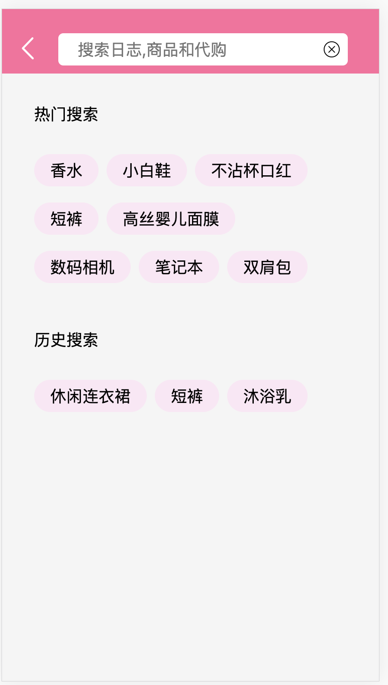

# 新生代(移动端页面、基于Vue框架)

###### 项目描述:  
这是一个海外代购网站移动端项目,本项目利用Vue2.x框架,实现​推荐,商城等页面的实现、登陆的验证与存储、以及路由跳转等功能
​
###### 项目职责:
1. 利用vue-cli搭建项目整体框架,利用Vue-router搭建项目的路由基础.
2. 利用非受控组件传参的形式,形成多种页面的无限瀑布流加载样式.
3. 根据vue-router实现点击跳转页面功能.
4. 通过express自己制定后台数据,传递id参数的形式,将单页面中的跳转详情页一一对应.
5. 通过vue-x、配合webstorage实现登陆、注册状态的存储及验证功能.
​

